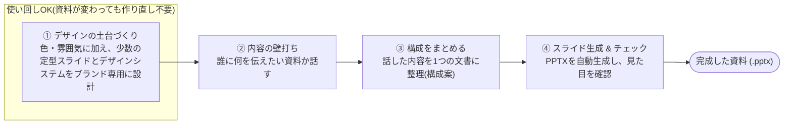

# pptx-origin

クローン→セットアップだけで、AIエージェント(Claude Code等)によるPPTX資料生成が使えるようになるリポジトリ。

実際に `.pptx` ファイルを組み立てる/編集する処理は自前実装せず、常に[Anthropic公式pptxスキル](https://github.com/anthropics/skills) に委譲する設計になっている。
本リポジトリが持つのは、決定論的なデザインシステム生成コードと、工程を橋渡しするSkill群のみ。

エージェント向けの指示は `AGENTS.md` に集約されている。`CLAUDE.md` はそれを読み込むだけの1行ファイルで、Claude Code以外のエージェント(Codex, Cursor, OpenCode等)は `AGENTS.md` を直接読む。
同様に、工程を橋渡しするSkill群の実体は `.agents/skills/`(多くのエージェントが素で参照する共通パス)に置き、Claude Code用に `.claude/skills/` からシンボリックリンクしている — Claude Codeは `.claude/skills/` 配下しか見に行かないため。

## セットアップ

```bash
# 1. 公式pptxスキルを導入する(.agents/skills/pptx/ に配置される)
npx skills add https://github.com/anthropics/skills --skill pptx --agent universal -y

# 2. 依存関係をインストールする
npm install
```

1.の `--agent universal` は、インストール先を `.agents/skills/pptx/` に固定するための指定(未指定だとマシン上で検出されたエージェント次第で配置先が変わり非決定的になる)。
Claude Code自身にもスキルとして認識させたい場合は `--agent claude-code` を追加すれば `.claude/skills/pptx` にもシンボリックリンクが張られるが、本リポジトリのSkill群は常に `.agents/skills/pptx/SKILL.md` をファイルとして直接読んで指示に従う設計のため、必須ではない。

これだけで `design-system/default/`(ニュートラルな配色・定型スライド一式。詳細は後述)がそのまま使える状態になっており、デザインシステム生成のためのセットアップ手順は不要。
独自のブランドを使いたい場合のみ、Claude Codeで `pptx-design-system-init` スキルを呼び出す(下記「使い方」参照)。以下のいずれかを選べる:

- 何も用意せず `design-system/default/` のニュートラルな配色・レイアウトのまま進める。
- `design-system/presets/`(`PRESETS.md`参照)から雰囲気の近い配色プリセットを選ぶ → `pptx-design-system-init` スキルにその旨を伝えると、プリセット一覧を提示した上で選んだ配色を新しいブランド用の `color-definition.json` としてコピーしてくれる。
- 会社名・製品名などブランドを指定し、独自の色定義ファイル(または対話でのヒアリング)から `design-system/<brand>/` に専用のテーマ一式を作る。

いずれの場合も、色だけでなく**表紙・章区切り・クロージングといった少数の定型スライド、およびそれ以外のスライドが従うデザインシステムスペック(モチーフ・装飾ルール・余白グリッド等)がブランドごとに新規設計**される。
`pptx-design-system-init` スキルが公式pptxスキルのデザイン力・ビジュアルQA手順を使って、このブランド専用の `components.js`・`DESIGN_SYSTEM.md`・`preview.pptx` を一度だけ作り込み、以降はその資産を固定で使い回す(`default` は既にこの資産を持つ状態でコミット済みなので、初回セットアップでは何もしなくてよい)。
定型スライドに当てはまらないスライド(標準コンテンツ・比較・テーブル等)は、資料生成のたびに公式pptxスキルがデザインシステムスペックの範囲内で都度自由に設計する。

## プロジェクト構成

```
pptx-origin/
├── AGENTS.md                                   # エージェント向け常時ロード型コンテキスト(本体)
├── CLAUDE.md                                   # AGENTS.mdをimportするだけの1行ファイル
├── README.md                                   # セットアップ手順・使い方
├── package.json                                # pptxgenjs 等の依存関係
├── .gitignore                                  # ユーザー成果物(design-system/*/ の default 以外・projects/*)と
│                                                # .agents/skills/pptx/ (公式スキル本体、非バンドル)を除外
├── .agents/
│   ├── reference/
│   │   └── fixed-primitives-contract.md        # 定型スライドの内容契約と自由設計カテゴリの参考一覧(ブランド非依存、
│   │                                            # pptx-build/pptx-design-system-init/pptx-qa の3Skillが横断的に参照する共有ファイル)
│   └── skills/
│       ├── pptx/                               # 公式pptxスキル(セットアップ手順1で導入、リポジトリにはバンドルしない)
│       ├── pptx-design-system-init/
│       │   ├── SKILL.md                        # 色定義ファイル→theme.js→preview.pptx生成
│       │   └── assets/                         # コピー用ひな形(components.skeleton.js・DESIGN_SYSTEM.skeleton.md)
│       ├── pptx-theme-from-tokens/SKILL.md     # DTCG形式トークン→color-definition.json変換
│       ├── pptx-research/SKILL.md              # 発散/調査フェーズ(スキップ可、AI自動補完)
│       ├── pptx-ssot/SKILL.md                  # 構成案(ssot.md)作成
│       ├── pptx-build/SKILL.md                 # 公式pptxスキルへのオーケストレーション
│       └── pptx-qa/SKILL.md                    # 公式pptxスキルのQAセクション遵守+独自チェック
├── .claude/
│   └── skills/                                 # 上記6つのSkillへのシンボリックリンク(Claude Code用)
│       ├── pptx-design-system-init -> ../../.agents/skills/pptx-design-system-init
│       ├── pptx-theme-from-tokens -> ../../.agents/skills/pptx-theme-from-tokens
│       ├── pptx-research -> ../../.agents/skills/pptx-research
│       ├── pptx-ssot -> ../../.agents/skills/pptx-ssot
│       ├── pptx-build -> ../../.agents/skills/pptx-build
│       └── pptx-qa -> ../../.agents/skills/pptx-qa
├── design-system/
│   ├── color-definition.example.json           # 色定義ファイルのスキーマ例(共通)
│   ├── color-definition.default.json           # デフォルト配色(ニュートラル、共通)
│   ├── presets/                                 # 選択式の配色プリセット(共通、PRESETS.md参照)
│   ├── design-tokens.example.json              # DTCG形式サンプル(共通、pptx-theme-from-tokens用)
│   ├── generate-theme.js                       # design-system/<brand>/color-definition.json → theme.js(共通、決定論的)
│   └── <brand>/                                 # ブランドごとのテーマ+レイアウト一式(任意名称、ユーザーが決める)
│       ├── color-definition.json               #   このブランドの色定義(入力)
│       ├── theme.js                            #   生成物(色・フォントの土台)
│       ├── components.js                       #   このブランド専用の定型スライドコード(公式pptxスキルで新規設計)
│       ├── DESIGN_SYSTEM.md                    #   このブランドのデザインシステムスペック(視覚言語・定型スライドのcontent契約)
│       └── preview.pptx                        #   生成物(定型スライドのビジュアルQA用サンプル資料)
│           # ↑ design-system/default/ のみリポジトリにコミットされるゼロコンフィグ用の1セット。
│           #   それ以外の <brand> はユーザー固有の成果物として .gitignore される。
│   # 定型スライドの名称・用途・contentフィールドの契約自体はブランドに依らず
│   # .agents/docs/fixed-primitives-contract.md で定義される
│   # (視覚実現だけがブランドごとに異なる)。
└── projects/
    ├── .gitkeep                                 # projects/<slug>/ はユーザー固有の成果物として .gitignore される
    └── <slug>/                                  # 1件の資料の作業ディレクトリ(任意名称、資料の題材から決める)
        ├── ssot.md                              #   入力: 対象読者・目的・章構成等をまとめた構成案(pptx-ssotが作成)
        ├── <slug>.pptx                          #   生成物: 完成した資料(pptx-buildが生成)
        └── build-<slug>.js                      #   生成物: 新規作成時のPptxGenJS生成スクリプト(再現用に保持)
```

## 使い方

Claude Code上で、パイプラインの各工程に対応する `pptx-*` スキルを順に呼び出す。
ざっくりとした流れは次の4ステップ。



- **①だけ使い回し可能。** ブランド(会社名・製品名など任意の名前をつけて `design-system/<brand>/` にまとめて保存される)ごとに一度作れば、以降そのブランドの資料では①をやり直す必要はない(最初は何も決めなくても `design-system/default/` のニュートラルなデザインがそのまま使える)。①は色定義に加えて、公式pptxスキルのデザイン力を使った定型スライド(表紙・章区切り・クロージング)の新規設計とビジュアルQAまで行うため、資料生成(②〜④)よりも重い一度きりの工程になる。それ以外のスライドは、①で決めたデザインシステムスペックの範囲内で④のたびに都度自由に設計される。
- ②〜④は資料を作るたびに毎回実行する。②は内容が既に固まっていればスキップも可能。
- ③で作る `projects/<slug>/ssot.md` と④で作る `projects/<slug>/<slug>.pptx` は、資料の題材に沿った名前(または任意の名前)を都度つける。1件の資料の材料(構成案)・最終成果物(.pptx)・生成スクリプトは同じ `projects/<slug>/` にまとまる。①のブランド名とは別の命名軸(1つのブランドを複数の資料が使い回す関係)。
- 対応するSkill: ① `pptx-design-system-init`(必要なら `pptx-theme-from-tokens` も) / ② `pptx-research` / ③ `pptx-ssot` / ④ `pptx-build` → `pptx-qa`。

```
# 例: 独自ブランドカラーで新しいデザインシステムを作りたいとき
> pptx-design-system-init スキルを使って、"acme" というブランド名でデザインシステムを作って

# 例: ブランドカラーは決めていないが、プリセットから雰囲気を選びたいとき
> pptx-design-system-init スキルで、色はプリセットから選びたい

# 例: Figma等のDesign Tokensファイルからcolor-definition.jsonを作りたいとき
> pptx-theme-from-tokens スキルで design-tokens.json から "acme" ブランドの色定義を作って

# 例: 資料の内容を詰めてから構成案を作りたいとき
> pptx-research スキルでテーマについて壁打ちしたい
> 内容が固まったので pptx-ssot スキルで構成案にまとめて

# 例: 構成案からスライドを生成し、QAまで通したいとき
> pptx-build スキルで projects/example/ssot.md から "acme" ブランドの資料を作って
> できた資料に pptx-qa スキルでQAをかけて
```

各スキルの詳細な手順は `.agents/skills/pptx-*/SKILL.md`(実体。Claude Codeからは `.claude/skills/pptx-*/` のシンボリックリンク経由で参照される)側に委譲されている。
定型スライドの内容契約は `.agents/docs/fixed-primitives-contract.md` を参照。
